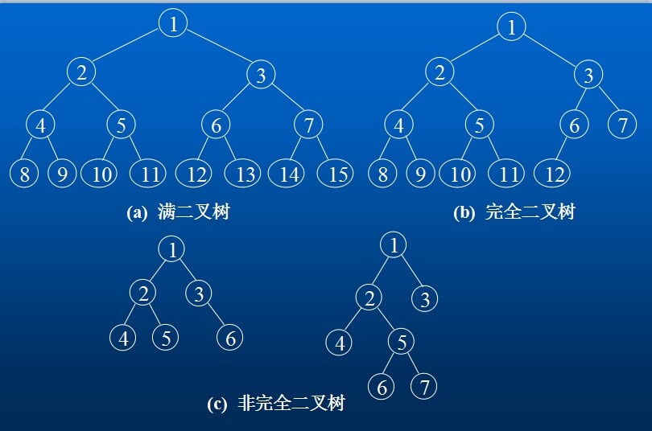

# 数据结构

## 哈希表

哈希表也叫散列函数，它对不同的输入值得到一个固定长度的消息摘要。理想的哈希函数对于不同的输入应该产生不同的结果，同时散列结果应当具有同一性和雪崩效应。

在js中，object属性的实现就是hash表，因此只要在object上简单封装方法，就可以使用object管理实现高效的hashtable了。

```
    class HashTable  {
        constructor() {
            this.hashTable = new Object();
            this.size = 0;
        }

        _hasKey(key) { // private fucntion
            return (key in this.hashTable);
        }

        add(key, value) {
            if(!this._hasKey(key)) {
                this.hashTable[key] = value;
                this.size++;
            }
        }

        remove(key) {
            if(this._hasKey) {
                delete this.hashTable[key];
                this.size--;
            }
        }

        getValue(key) {
            if(this._hasKey(key)) {
                return this.hashTable[key];
            }
            return null;
        }

        getSize() {
            return this.size;
        }

        clear() {
            this.hashTable = new Object();
            this.size = 0;
        }
    }
```

## 队列

队列是FIFO的有序集合，新增加的元素放在队尾，要移除的元素在队列的顶部。

```
        class Queue {
            constructor() {
                this.queue = [];
            }

            enqueue(item) { // 添加元素
                if (typeof item != 'undefined') {
                    this.queue.push(item);
                }
            }

            dequeue() { // 移除队顶元素
                if (this.queue.length > 0) {
                    return this.queue.shift();
                }
                return undefined;
            }

            front() { // 获取队顶元素，不移除
                if (this.queue.size > 0) {
                    return this.queue[0];
                }
                return undefined;
            }

            isEmpty() { // 判断队列是否为空
                if (this.queue.size > 0) {
                    return false;
                }
                return true;
            }

            getLength() { // 获取队列长度
                let length = this.queue.length;
                return length;
            }

            clear() { // 清空队列
                this.queue = [];
            }

            print() { // 用于打印观察队列的情况
                this.queue.forEach((item, index) => {
                    console.log(`${index} = ${item}`);
                })
            }
        }

```

## 栈

栈是LIFO的有序集合，只在表尾进行删除和插入的操作。

```
        class Stack {
            constructor() {
                this.stack = [];
            }

            push(item) { // 入栈
                this.stack.push(item);
            }

            pop() { // 出栈
                return this.stack.pop();
            }

            peak() { // 返回栈顶元素
                if (this.stack.length > 0) {
                    return this.stack[this.stack.length - 1];
                }
                return undefined;
            }

            clear() { // 清空栈内所有元素
                this.stack = [];
            }

            isEmpty() { // 判断是否为空
                return !(this.stack.length > 0);
            }

            print() { // 用于打印观察栈的情况
                this.stack.forEach((item, index) => {
                    console.log(`${index} = ${item}`);
                })
            }
        }
```

## 链表

链表是由一组节点组成的集合，每个节点都使用一个对象的索引来指向它后一个节点。指向另一个节点的引用叫做链。

```
        class Node {
            constructor(element) {
                this.element = element; // 当前节点的元素
                this.next = null; // 指向下一个节点
            }
        }

        class LList {
            constructor(element) {
                let node = new Node(element);
                this.headNode = node; // 头结点
            }

            insert(newElement, element) { // 插入节点
                let preNode = this.find(element);
                if (preNode) {
                    let node = new Node(newElement);
                    node.next = preNode.next;
                    preNode.next = node;
                }
            }

            remove(element) { // 删除节点，注意headNode的指向
                if(this.headNode.element == element) {
                    this.headNode = this.headNode.next;
                    return true;
                }
                let preNode = this.findPrev(element);
                if (preNode) {
                    preNode.next = preNode.next.next;
                }
            }

            find(element) { // 查找节点
                let currentNode = this.headNode;
                while (currentNode != null && currentNode.element != element) {
                    currentNode = currentNode.next;
                }
                return currentNode;
            }

            findPrev(element) { // 查找前一个节点
                let preNode = null, currentNode = this.headNode;
                while (currentNode != null && currentNode.element != element) {
                    preNode = currentNode;
                    currentNode = currentNode.next;
                }
                if (currentNode == null) {
                    return null;
                }
                return preNode;
            }
        }

```

## 双向链表

虽然从链表的头结点遍历链表很简单，但是反过来，从后向前遍历就很难。为了使从后向前的遍历变得简单，我们给Dnode类增加一个previous属性，指向前一个元素，这就是双向链表。

```        class Dnode {
            constructor(element) {
                this.element = element;
                this.next = null;
                this.previous = null;
            }
        }

        class DlList {
            constructor(element) {
                let headNode = new Dnode(element);
                this.headNode = headNode;
            }

            insert(newElement, element) { // 插入节点
                let preNode = this.find(element);
                if (preNode) {
                    let node = new Dnode(newElement);
                    node.previous = preNode;
                    node.next = preNode.next;
                    preNode.next = node;
                    node.next && (node.next.previous = node);
                }
            }

            remove(element) { // 删除节点,注意headNode的指向
                let currentNode = this.find(element);
                if(this.headNode.element == element) {
                    this.headNode = this.headNode.next;
                }
                currentNode.previous && (currentNode.previous.next = currentNode.next);
                currentNode.next && (currentNode.next.previous = currentNode.previous);
            }

            find(element) { // 查找节点
                let currentNode = this.headNode;
                while (currentNode != null && currentNode.element != element) {
                    currentNode = currentNode.next;
                }
                return currentNode;
            }
        }

```

## 二叉树和平衡二叉树

二叉树是一种树型结构，它的特点是每个结点至多只有两个子树，并且，二叉树有左右之分，次序不能随意颠倒。

> 二叉树的性质：

```
（一）在二叉树的第i（i>=1）层至多有2^(i-1)个结点。
（二）深度为k（k>=1）的二叉树至多有2^K-1个结点。
（三）对于任何一颗二叉树T，如果其终端结点为n0,度为2的结点数为n2,则n0=n2+1。
      满二叉树是深度为k且有2^k-1个结点的二叉树。
      完全二叉树：深度为k的，有n个结点的二叉树，当且仅当其每一个结点都与深度为k的满二叉树中的编号从1到n的结点一一对应时的二叉树。
（四）一个具有n个结点的完全二叉树的深度为Math.floor(log2 n)+1。
（五）如果对一颗有n个结点的完全二叉树（其深度为Math.floor(log2 n)+1）的结点按层编号，则对任一结点（1<=i<=n）有：
     a.如果i=1，则结点i是二叉树的根接点，没有双亲。如果i>1,则其双亲parent(i)是结点Math.floor(i/2);
     b.如果2*i>n，则结点i无左孩子。否则其左孩子结点是2*i;
     c.如果2*1+1>n,则结点无右孩子。否则其右孩子结点是2*i+1。
（六）平衡二叉树满足以下条件：一棵空树或它的左右两个子树的高度差的绝对值不超过1，并且左右两个子树都是一棵平衡二叉树。
```




> 二叉树的遍历方式：

```
（一）先序遍历：先访问根节点，然后再分别先序遍历左子树和右子树。
（二）中序遍历：先中序遍历左子树，然后访问根节点和中序遍历右子树。
（三）后序遍历：先后序遍历左子树和右子树。然后访问根节点。
```

## 参考文档

[哈希表(hashtable)的javascript简单实现](https://www.cnblogs.com/hyl8218/archive/2010/01/18/1650589.html)

[JavaScript数据结构《队列》](https://segmentfault.com/a/1190000011374405)

[javascript实现数据结构： 树和二叉树,二叉树的遍历和基本操作](https://www.cnblogs.com/webFrontDev/p/3865719.html)
