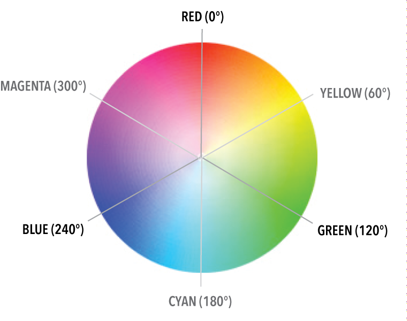

# CSS知识点(一)

## 1.css清除浮动

> 当非IE浏览器下，当容器的高度为`auto`，且容器的内容中有浮动(`float`为`left`或`right`)的元素，在这种情况下，容器的高度不能自动伸长以适应内容的高度，使得内容溢出到容器外面而影响布局的现象。这个现象叫浮动溢出，为了防止这个现象的出现而进行的CSS处理，就叫CSS清除浮动。

> 清除浮动方法一：使用带`clear`属性的空元素

在浮动元素后使用一个空元素如`<div style="clear:both"></div>`属性即可清除浮动。

> 清除浮动方法二：使用CSS的`overflow`属性

给浮动元素的容器添加`overflow:hidden;`或`overflow:auto;`可以清除浮动，另外在IE6还需要触发`hasLayout`，例如为父元素设置容器宽高或设置`zoom:1`。添加以下样式：

```
.clear {
    overflow: hidden;
    *zoom: 1; // IE6, IE7，触发hasLayout属性
}
```

> 清除浮动方法三：使用邻接元素处理

给浮动元素后面的元素添加clear样式,该元素有内容:

```
.clear {
    clear:both
}
```

> 清除浮动方法四：使用`:after`伪元素(推荐使用)

给浮动元素的容器增加一个类`clearfix`:

```
.clearfix:after {
    content: '';
    display: block;
    clear: both;
    visibility: hidden;
}
.clearfix {
    zoom: 1;
}
```

## 2.position取值

|取值|含义|
|---|---|
|static|默认值，不会被特殊定位，包含在文档流中|
|relative|可以设置`top`、`right`、`bottom`、`left`属性使其偏离正常位置。不会脱离文档流，不影响其他元素|
|fixed|固定定位，相对于视窗来定位，可以设置`top`、`right`、`bottom`、`left`属性来指定元素位置，元素会脱离文档流|
|position|相对于最近的“`positioned`”（非`static`定位）祖先元素定位。如果元素没有“`positioned`”祖先元素，那么它会相对于文档的body定位，元素会脱离文档流|


## 3.z-index不生效的场景有哪些 

> z-index设置元素的堆叠顺序。拥有更高堆叠顺序的元素总是处于堆叠顺序较低元素的前面。注意，z-index仅能在定位元素(relative、fiexed、position)上生效。

#### 1.堆叠顺序

1.当不包含z-index和position属性时，所有元素的堆叠顺序与其所在HTML文档中出现的先后顺序一致，叫做“后来居上”原则。

2.当元素浮动float时，浮动块元素被放置于非定位块元素与块元素之间。具体地讲，浮动元素显示在普通流中的后代块元素上，常规流中的后代行内元素之下。

3.当加入position位置属性（position属性为非static）时，所有具有position属性的元素及其子元素会显示在其他不具有position属性的元素上面。

4.当引入index属性时，会产生堆叠上下文。

#### 2.堆叠上下文

拥有共同父元素的一组元素共同前移或者后移即构成了一个堆叠上下文。每个堆叠上下文有一个单一的根元素，当元素上形成一个新的堆叠上下文时，堆叠上下文中的所有子元素按照堆叠顺序被局限在一个固定的区域内。**一个堆叠上下文构成一个整体，其内部元素有相对不同的堆叠顺序，但与其他堆叠上下文比较时，只能整体上移或者下移。**

那么，可以得到结论：如果某个元素被置于其所在堆叠上下文的最底层，即使把z-index设置得无限大，也无法让它显示在另一个拥有更高堆叠顺序的堆叠上下文元素之上的。这叫做“从父原则”。

哪些情况会构成一个堆叠上下文？

1.文档的根元素(html元素)。

2.元素拥有position属性不为static值，同时设置了不为auto的z-index属性值。

3.元素拥有opacity属性，且取值小于1。

4.一些新的css属性，如filters，css-regions，paged media等需要离屏渲染的属性，均能使元素形成堆叠上下文。

5.指定position:fixed的元素，即使z-index:auto。

#### 3.同一堆叠上下文内子元素的堆叠顺序

从底层到上层依次为：

1.堆叠上下文的根元素。

2.设置了position属性，并且z-index为负的元素及其子元素，z-index值较大的元素置于较小值元素之上，同等属性值的元素按照html中出现的先后顺序堆叠。

3.没有设置position的元素。

4.设置了position属性，并且z-index属性为auto的元素。

5.设置了position属性，并且z-index为正值的元素。

#### 4.不同堆叠上下文

1.堆叠上下文可以嵌入其他堆叠上下文。

2.每个堆叠上下文和它的同级上下文是独立的。

3.堆叠上下文的子元素按照前述顺序摆放。

4.堆叠上下文内部的子堆叠上下文的z-index只在父堆叠上下文中有意义。

## 4.不定宽高元素垂直水平居中

> 法一:position+transform

```
.wrap {
    position: relative;
}
.center {
    position: absolute;
    top: 50%;
    left: 50%;
    transform: translate(-50%,-50%);
}
```
注意：此法一定要设置父元素为positioned定位（relative、absolute、fixed）。

> 法二：flex

```
.wrap {
    display: flex;
    justify-content: center;
    align-item: center;
}
```

## 5.css实现一个占屏幕宽度50%的正方形

这里我们利用margin-bottom属性的特殊性，当margin-bottom属性时百分数时，它会基于父元素的宽度计算下边距。那么，我们可以把margin-bottom设置为50%，也就是屏幕宽度的50%。

```
.square {
    width: 50%;
    height:0;
    padding-bottom: 50%;
    background: green;
}
```

缩放浏览器窗口可以看到，一个绿色的正方形正好宽度正好为屏幕宽度的50%。

## 6.HSL色彩模型是什么，在CSS中如何使用

HSL模式是一个基于360色相环。
第一个数字代表色相环角度，60度是黄色，120度是绿色，180度是青色，240度是蓝色，300度洋红色，360度红色。
第二个数字代表饱和度，值为百分比。
第二个数字代表亮度，值为百分比。

```
hsl(60,50%,90%)
```


## 7.参考文献

[CSS-清除浮动](https://segmentfault.com/a/1190000004865198)

[说一说z-index容易被忽略的那些特性](https://cloud.tencent.com/developer/article/1009694)