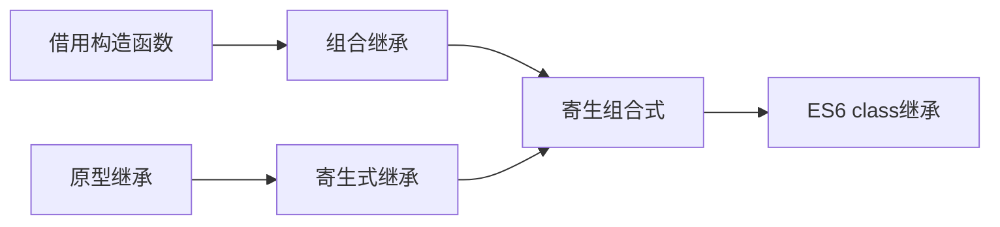

# 原型链与继承

## 原型链

#### 概念

ECMAScript只支持实现继承，是依靠原型链来实现的。

> 每个构造函数（constructor）都有一个原型对象（prototype），原型对象都包含一个指向构造函数的指针，而实例（instance）都包含一个指向原型对象的内部指针。当试图引用对象（实例instance）的某个属性，会首先在对象内部寻找该属性，如果找不到，会在对象的原型（`instance.__proto__`）里去找这个属性。

如果让原型对象指向另一个类型的实例，那么有趣的事情就发生了。

即：`constructor1.prototype = instance2`。其中`instance2`是`constructor2`的一个实例。

此时，我们生成一个实例 `instance1 = new constructor1();`。然后尝试在instance1中查找某个属性`p`：

1.首先，程序会在`instance1`内部属性查找一遍。

2.接着会在`instance1.__proto__(constructor1.prototype)`中查找一遍，而`constructor1.prototype`实际是`instance2`，也就是会在`instance2`的内部属性中查找`p`。

3.如果`instance2`也没有内部属性`p`，程序会继续在`instance2.__proto__(constructor2.prototype)`中寻找，如果还没有找到，会一直向上寻找，直至`Object`的原型对象。

> 搜索轨迹：`instance1-->instance2-->constructor2.prototype...-->Object.prototype`

这种搜索的轨迹，形似一条长链，又因为`prototype`在查找中充当链接的作用，于是把这种实例与原型的链条叫做**原型链**。

可以通过`instanceOf`操作符和`isPrototypeOf()`方法可以判断实例和原型的关系。

`instanceOf`操作符，只要是原型链中出现过的构造函数，结果都会返回true。

`isPrototypeOf()`只要是原型链中出现过的原型，结果都会返回true。

#### 原型链的问题

然而，原型链并不完美，它有以下两个问题：

> 问题一：当原型链中包含引用类型值的原型时，该引用类型值会被所有的实例共享。

> 问题二：在创建子类型时，不能向超类型的构造函数中传递参数。

为此，实践中很少单独使用原型链，通常会有采取其他方法来弥补原型链的不足。

## js继承的方式与实现

下面介绍几种继承方式，它们的关系是：




#### 借用构造函数

为了解决原型链中的问题，我们开始使用一种叫做**借用构造函数**的技术。

> 基本思想：即在子类型构造函数的内部调用超类型构造函数。

```
function Father() {
    this.colors = ['green', 'blue', 'red'];
    this.sayHello = function() {
        console.log('father hello');
    }
}

function Son() {
    Father.call(this); // 继承Father，并且支持向父类构造函数传递参数
}

var instance1 = new Son();
instance1.colors.push('black');
console.log(instance1.colors); // ['green', 'blue', 'red', 'black]
instance1.sayHello(); // father hello

var instance2 = new Son();
console.log(instance2.colors); // ['green', 'blue', 'red']
```

从上面的代码可以看出：

第一，原型链中引用类型的值是独立的，不再被所有实例共享。

第二，子类型在创建时也可以向父类型传递参数。

随之而来的，如果仅仅借用构造函数，那么将无法避免构造函数模式存在的问题-方法都在构造函数中定义，因此函数的复用也就不可用了。

#### 组合继承

组合继承，也叫伪经典继承，指的是将原型链和借用构造函数的技术组合到一块，从而发挥两者之长的一种继承模式。

> 基本思路：使用原型链实现对原型属性和方法的继承，通过借用构造函数来实现对实例属性的继承。

这样既能通过在原型上定义方法实现复用，又能保证每个实例都有它自己的属性。

```
function Father(name) {
    this.name = name;
    this.colors = ['red', 'blue', 'green'];
}

Father.prototype.sayName = function() {
    console.log(this.name);
}

function Son(name, age) {
    Father.call(this, name); // 继承实例属性，第一次调用Father()
    this.age = age; 
}

Son.prototype = new Father(); // 继承父类方法，第二次调用Father()
Son.prototype.sayAge = function() {
    console.log(this.age);
}

var instance1 = new Son('louis', 5);
instance1.colors.push('black');
console.log(instance1.colors); // ['red', 'blue', 'green', 'black']
instance1.sayName(); // louis
instance1.sayAge(); // 5

var instance2 = new Son('zhang', 10);
console.log(instance2.colors); // ['red', 'blue', 'green', 'black']
instance2.sayName(); // zhang
instance2.sayAge(); // 10
```

组合继承避免了原型链和借用构造函数的缺陷，融合了他们的优点，称为JavaScript中最常用的继承模式。而且，`instanceOf`和`isPrototypeOf()`也能用于识别基于组合继承创建的对象。

但是，这个方式也存在一点问题，它调用了两次父类构造函数，造成了不必要的消耗。

#### 原型继承

这个方法最初由道格拉斯·克罗克福德提出，他说道借助原型可以基于已有的对象创建新对象，同时还不必因此创建自定义类型。

> 方法：在object()函数内部，先创建一个临时性的构造函数，然后将传入的对象作为这个构造函数的原型，最后返回了这个临时类型的一个新实例。

```
function object(o) {
    function F() {};
    F.prototype = o;
    return new F();
}
```

从本质上讲，object()对传入其中的对象执行了一次浅复制。下面的例子说明了问题：

```
var person = {
    friends: ['Van', 'Louis', 'Nick']
};

var anotherPerson = object(person);
anotherPerson.friends.push('Rob');
var yetAnotherPerson = object(person);
yetAnotherPerson.friends.push('Style');
console.log(person.friends); //  ["Van", "Louis", "Nick", "Rob", "Style"]
```

在上面的代码中，`person`对象作为基础对象，生成了两个新的对象，这两个对象将`person`作为原型，因此它的原型上就包含引用类型值属性。这就意味着`peroson.friends`不仅归`person`所有，其也会被`anotherPerson`和`yetAnotherPerson`共享,他们也可以读写这个对象属性。

在ECMAScript5中，通过新增的`Object.create()`方法规范了上面的原型式继承。

`Object.create()`接收两个参数:

- 一个用作新对象原型的对象

- 一个可选的为新对象定义额外属性的对象

```
var person = {
    friends: ['Van', 'Louis', 'Nick']
};

var anotherPerson = Object.create(person);
anotherPerson.friends.push('Rob');
var yetAnotherPerson = Object.create(person);
yetAnotherPerson.friends.push('Style');
console.log(person.friends); // ["Van", "Louis", "Nick", "Rob", "Style"]

```
上面的代码可以看出，Object.create()只有一个参数时功能与之前的object()方法相同，它的第二个参数与Object.defineProperties()方法的第二个参数格式相同：每个属性都是通过自己的描述符定义的，**以这种方式指定的任何属性都会覆盖原型对象上的同名属性。**

```
var person = {
    name: 'Louis'
}

var anotherPerson = Object.create(person, {
    name: {
        value: 'Rob'
    }
});

console.log(anotherPerson.name); // Rob
```

目前支持Object.create()的浏览器有IE9+,Firefox 4+, Safari 5+, Opera 12+ 和 Chrome。

**原型继承中，包含引用类型值的属性始终都会共享响应的值，就像使用原型模式一样。**

#### 寄生式继承

寄生式继承与原型式继承紧密相关的一种思路，同样是道爷推而广之。

> 基本思想：创建一个仅用于封装继承过程的函数，该函数在内部以某种方式来增强对象，最后再像真的是它做了所有工作一样返回对象。

```
function object(o) {
    function F() {};
    F.prototype = o;
    return new F();
}

function createAnother(original) {
    var clone = object(original); // 通过调用object函数创建一个新对象
    clone.sayHi = function () { // 以某种方式增强这个对象
        console.log('hi');
    }
    return clone; // 最后返回这个对象
}

var person = {
    name: 'bob'
};

anotherPerson = createAnother(person);
console.log(anotherPerson.name); // bob
anotherPerson.sayHi(); // hi

```

使用寄生式继承来为对象添加函数，会由于不能做到函数复用而降低效率，这一点和构造函数模式类似。

#### 寄生组合式继承

最完美、最常用的继承方式就要呼之欲出啦~

前面讲过，组合继承是JavaScript最常用的继承模式，但是由于它有自己的不足-无论什么情况下，都会两次调用父类构造函数：一次是在创建子类原型的时候，一次是在子类构造函数内部。那么，**寄生组合式继承，完美地解决了这个问题，降低了调用父类构造函数的开销。**

> 基本思想：不必为了指定子类型的原型而调用超类型的构造函数。

```
function object(o) {
    function F() {};
    F.prototype = o;
    return new F();
}

function extend(subClass, superClass) {
    var prototype = object(superClass.prototype); // 创建对象
    prototype.constructor = subClass; // 增强对象
    subClass.prototype = prototype; // 指定对象
}

function Father(name) {
    this.name = name;
}

Father.prototype.sayName = function () {
    console.log(this.name);
}

function Son(name, age) {
    Father.call(this, name);
    this.age = age;
}

extend(Son, Father);

Son.prototype.sayAge = function() {
    console.log(this.age);
}

var instance1 = new Son('Lious', 20);
instance1.sayName(); // Lious
instance1.sayAge(); // 20
```

extend的高效率体现在它没有调用SuperClass构造函数，因此避免了在subClass.prototype上面创建不必要多余的属性，与此同时，原型链还能保持不变。因此能正常使用instanceOf和isPrototypeOf()方法。

以上，**寄生组合式继承，集寄生式继承和组合继承的优点于一身，是实现基于类型继承最有效的方法。**

下面，我们来看extend的另一种更有效的扩展。

```
function extend(subClass, superClass) {
    var F = function () {};
    F.prototype = superClass.prototype;
    subClass.prototype = new F();
    subClass.prototype.constructor = subClass;

    subClass.superClass = superClass.prototype;
    if(superClass.prototype.constructor == Object.prototype.constructor) {
        superClass.prototype.constructor = superClass;
    }
}

function Father(name) {
    this.name = name;
}

Father.prototype.sayName = function () {
    console.log(this.name);
}

function Son(name, age) {
    Father.call(this, name);
    this.age = age;
}

extend(Son, Father);

Son.prototype.sayAge = function() {
    console.log(this.age);
}

var instance1 = new Son('Lious', 20);
instance1.sayName(); // Lious
instance1.sayAge(); // 20

```

为什么要执行`new F()`，既然extend的目的是将子类型的prototype指向超类型的prototype，为什么不直接赋值呢？

```
subClass.prototype = superClass.prototype; // 直接指向超类型的prototype
```

显然，上面的操作之后，子类型原型与超类型的原型共用，根本没有继承关系。

#### ES6 class继承

ES6出现了`class`的语法，并给出了基于`class`的继承方法，这个方法和寄生组合式继承的原理基本相同。实现如下：

```
class Father {
    constructor(name) {
        this.name = name;
    }

    sayName() {
        console.log(this.name);
    }
}

class Son extends Father {
    constructor(name, age) {
        super(name); // 需先调用父类型的构造函数
        this.age = age;
    }

    sayAge() {
        console.log(this.age);
    }
}

var instance1 = new Son('Lious', 20);
instance1.sayName(); // Lious
instance1.sayAge(); // 20
```

ES5的继承，实质上是先创造了子类的实例对象`this`，然后再将父类的方法添加到`this`上面`(Father.call(this))`。ES6的继承机制完全不同，实质是先将父类实例对象的属性和方法，加到`this`上面（调用`super`方法）,然后再用子类的构造函数修改`this`。

## `new`运算符

`new`运算符具体干了什么工作？它主要做了以下三件事：

```
var obj = {};
obj.__proto__ = F.prototype;
F.call(obj);
```

1.创建一个空对象`obj`。

2.将这个空对象的`__ptoto__`属性指向了函数`F`的`prototype`属性。

3.将F函数对象的`this`指针替换成了`obj`。

其实，`new`操作符调用构造函数时，函数内部实际发生了以下变化：

```
1.创建了一个空对象，并且this变量引用该对象，同时还继承了该函数的原型。

2.属性和方法被加入到this引用的对象中。

3.新创建的对象用this引用，并且最后隐式地返回this。
```

## 参考文献

JavaScript高级程序设计

[详解JS原型链与继承](http://louiszhai.github.io/2015/12/15/prototypeChain/)