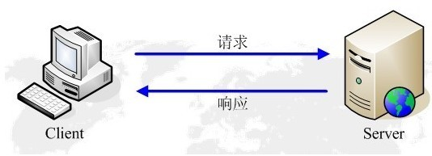

# HTTP协议
HTTP（HyperText Transfer Protocol，超文本传输协议）是建立在应用层的协议，是万维网数据通信的基础，负责服务器到客户端之间的数据传输。一般模式是客户端发送请求，服务器响应客户端发送的请求来完成数据交互。HTTP并没有规定必须使用它的层或它支持的层，尽管TCP/IP协议栈目前使用最多，但是任何能够提供可靠传输的协议都可以被使用。

## 1、HTTP的特征

- 采用客户端/服务器的模式

- HTTP最初的设计目的是提供一种发布和接受HTML页面的方法，所以HTTP是**无连接无状态**的协议。

- HTTP对传输的数据类型没有限制，使用灵活。

- HTTP协议的默认端口是80。

## 2、HTTP请求响应模型
HTTP采用B/S模式，客户端发出请求，服务器响应请求。

## 3、HTTP工作过程

在浏览器的地址栏输入`www.google.com`会发生什么呢？有哪些工作在我们看不见的地方进行呢？

> 第一步：地址解析

当浏览器拿到`www.google.com`这个url时,并不知道应该去哪里请求资源。所以会发出DNS请求解析这个url，获得服务器的IP地址和端口号。

> 第二步：封装HTTP请求报文

拿到主机IP地址后，浏览器会把请求的协议、主机号、端口号和资源路径结合本机的信息封装成一个HTTP请求包。

> 第三步：封装TCP包，建立TCP连接

在HTTP到达TCP后，TCP需要先和服务器建立连接，建立连接时采用TCP三次握手的方式。当TCP建立好连接之后，将收到的HTTP报文加上TCP报文的首部信息，组装成新的TCP报文。

> 第四步：客户端发送请求

此时，客户端发送一个请求给服务器，请求的信息主要包括统一资源标识符，版本协议号以及MIME信息。

> 第五步：服务器响应

服务器收到请求，经过处理后会返回响应信息，主要包括状态行、协议版本号和状态码、MIME信息等。

> 第六步：关闭TCP连接

一般情况下，服务器返回响应后会关闭TCP连接。但是如果在浏览器或服务器的头部信息中加入`Connection:keep-alive`后，TCP连接将会保持到会话结束。保持连接的做法节省了每次请求建立连接的时间和带宽成本。

## 4、报文结构

## 5、请求方法
HTTP/1.1协议中定义了八种方法来操作指定资源
|方法名|主要用途|
|:----|:----|
|GET|像指定的资源发出“显式”请求，只会读取数据，不会产生副作用|

## 6、状态码

## 7、HTTP缓存机制

## 8、HTTP1.0、HTTP1.1与HTTP2.0
