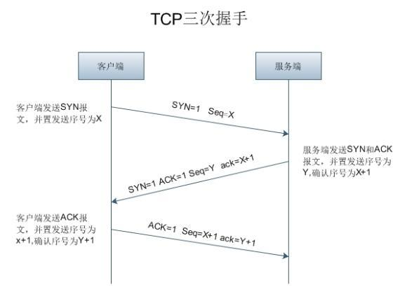

# TCP协议

TCP协议提供一种面向连接的、可靠的字节流服务。

## 1、TCP三次握手

TCP在建立一各连接时，需要客户端和服务器总共发送三个包。

三次握手的主要目的是连接服务器指定端口，建立TCP连接，并同步连接双方的序列号和确认号，交换TCP窗口信息大小。

> 第一次握手（SYN=1,Seq=x）

客户端发送一个TCP的SYN=1的包，告知打算连接的服务器端口和初始序列X.

此时，客户端进入`SN_SEND`状态。

> 第二次握手(SYN=1,ACK=1,Seq=y,ACKnum=x+1)

服务器发回确认包(ACK)和请求连接(SYN)的应答，即SYN=1，ACK=1。服务器选择自己的序号y，放在Seq域里，同时将确认序号设置为客户端报文的Seq+1，即x+1。

发送完毕后，服务器端进入`SYN_RCVD`。客户端接收回应后进入`ESTABLISHED`状态。

> 第三次握手(ACK=1,ACKnum=y+1)

客户端再次发送确认包(ACK=1),同时将确认序列号设置为y+1。

当服务器端接收到这个包时，进入`ESTABLISHED`状态，TCP握手结束。

客户端发送

> 为什么需要三次握手？而不是两次握手？也不是四次握手？

为了防止失效的连接请求报文段被服务器端接受，从而产生错误。

若建立连接只需两次握手，客户端并没有太大的变化，仍然需要获得服务端的应答后才进入ESTABLISHED状态，而服务端在收到连接请求后就进入ESTABLISHED状态。此时如果网络拥塞，客户端发送的连接请求迟迟到不了服务端，客户端便超时重发请求，如果服务端正确接收并确认应答，双方便开始通信，通信结束后释放连接。此时，如果那个失效的连接请求抵达了服务端，由于只有两次握手，服务端收到请求就会进入ESTABLISHED状态，等待发送数据或主动发送数据。但此时的客户端早已进入CLOSED状态，服务端将会一直等待下去，这样浪费服务端连接资源。

四次握手也是可以的，只是第四次握手和第二次握手做的事情重复了。现实情况是不会有完全可靠的协议，所以三次握手是建立可靠连接的最低成本。

## 2、TCP四次挥手

## 3、TCP、UDP的使用场景

TCP是面向连接的协议，可靠性高但效率低，适用于文件传输、重要状态的更新等场景。
UDP是非连接协议，可靠性低但是效率高，适用于实时要求高的通信，如视频通话等。