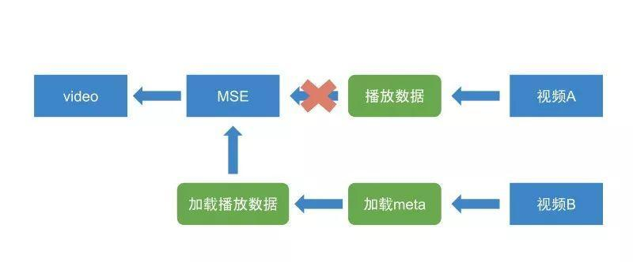

# flv

flv的全称是Flash Video，即专门给flash播放器提供的播放格式，具有结构简单、清晰的优点。新的video标签不支持flv格式，人们开始把web视频播放的重点放在mp4或者hls上，但是随着直播的兴起，flv迎来的一轮生机。

## 常用直播方案

首先，横向对比一下可用的直播方案：

|协议|http-flv|rtmp|hls|dash|
|----|----|----|----|-----|
|传输层|http|tcp|http|http|
|视频格式|flv|flv tag|Ts文件|Mp4、3gp、web|
|延时|低|低|很高|高|
|数据分段|连续流|连续流|切片文件|切片文件|
|原生video|不支持|不支持|部分支持|极少支持|
|服务器编程难易|简单|一般|一般+|中等|

## flv播放方案

flv的编码格式决定了只需要一个MetaData以及音频Track各自的Header就可以在任意时间点播放，正好满足直播的需求，是理想的解决方案。

下面看一下前端播放flv的过程：


从流程图可以看此，flv的播放过程就是从flv中提取元信息、音视频header以及数据，然后转码成fmp4盒子结构，再通过MSE交给video的过程。因为flv是流式结构，数据被拆分成多个tag，可以方便地做数据封装。这意味着，将一段flv tag数据封装成一个独立的moof_mdat盒子对交给MSE处理是很方便的事情。

## 数据加载

数据加载直播和点播两种模式。

#### 点播

针对点播的数据获取，采用Range参数来作为分段的控制参数。如：


```
Request Headers:
Origin: http://xxxx
Range:bytes=100000-3987705
User-Agent:Mozilla/5.0
```

上面的请求表示向服务器请求一个flv文件的100000到3987705个字节的数据，服务器收到响应后需要能够根据Range参数正确返回这段数据。


#### 直播

直播的方式和点播不同，直播的过程是推流->服务端格式编码->终端播放的一个过程。这样的话，我们不可以像点播时加载数据了，因为服务器实际上保存的是一个文件流，不断有数据推送到服务器，播放器也不存在缓存一段数据的情况，而是不断向服务器请求，只要新的流到达服务器，播放器就要拿到这一段进行解码播放，达到推流和拉流同步进行的一个直播效果。为了实现这种效果，在播放器内，使用fetch+streamReader，简单实现如下：

```
function resolve(reader) {
    reader.read().then(result => {
        callback(result.done ? undefined : result.value);
        resolve(reader);
    });
}
fetch(config).then(res => {
    const reader = res.body.getReader();
    resolve(reader);
});
```

我们通过一个reader递归地从流里面读取数据，再将数据交给解码器处理。


## 播放时跳转

播放时点击进度条跳转（以下称seek）是一个非常高频的操作，尤其是在长视频中。用户遇到不想看的部分或想重看的部分都会点击进度条触发seek。


那么，如果一段视频，用户可能实际只观看了不到50%，如果我们将整段视频加载，那未观看的50%就浪费掉了。所以我们要做的事情就是精确地加载用户希望播放的部分，节约流量。解决方案如下：


1. 获取用户将要跳转到的时间点，下称seekTime，根据seekTime计算出离该时间点最近的一帧的位置，称为startPos。
2. 以预加载时间为30s为例，计算出seekTime+30s这个时间点最近的一帧的位置，称为endPos。
3. 以Range:startPos-endPos为请求参数，向服务器请求一段数据。
4. 解码播放。

上面说到，需要根据用户的跳转时间获取最近一帧的位置，那么具体应如何实现呢？

这是依靠flv文件的onMetaData信息中地keyframes这个属性，它记录了flv中所有关键帧的时间点和文件便宜量，keyframes的格式大概是：

```
{
    times: [0, 2000, 4000, 6000, ...],
    fileopsitions: [...]
}
```

其中，times数组中每一个时间点对应着同样位置的fileposition的偏移量，正是基于这一点，我们可以计算出需要加载的数据Range。值得注意的一点是，并不是所有文件都携带了keyframes头，flv文件缺失部分onMetaData属性时很常见的事情。缺失了keyframes信息，我们就没办法做跳转了，因此我们需要借助额外的工具帮我们补全flv的onMetaData信息（推荐使用yamdi）。


## 清晰度切换

清晰度切换是一个非常重要的功能，用户会根据网络状况切换视频的清晰度来进行播放。

那么，多个清晰度的视频源如何实现无缝切换呢？下面具体来讨论一下。

#### 点播清晰度切换

点播中的清晰度切换方案是比较容易实现的。流程如下：



在切换清晰度时，尝试加载视频B，通过视频B的onMeataData中提取关键帧信息，推算出当前应该加载哪一个关键帧，然后加载这个位置之后的数据。直到数据加载到之后交给MSE，并清除掉之前视频A在buffer中的缓存。

#### 直播中的清晰度切换

直播中的清晰度切换目前没有发现无缝方案，建议在切换的时候直接重建解码器以及MSE。

## 参考文献

[洞察video超能力系列——玩转flv](https://techblog.toutiao.com/2018/08/13/untitled-52/)