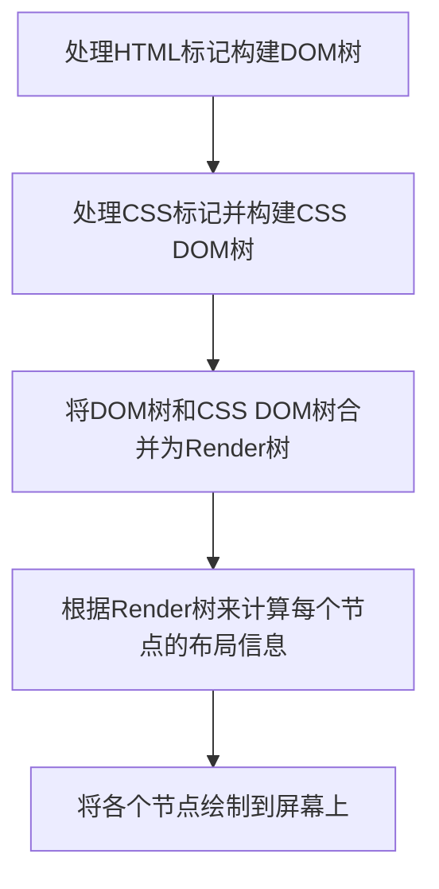

# 浏览器渲染

## 1、主要概念

> 关键渲染路径

指与当前用户操作有关的内容。例如刚刚用户打开了一个页面，首屏的显示就是当前用户操作相关的内容，具体就是浏览器收到HTML、CSS和JavaScript等资源并对其进行处理从而渲染出Web页面。

了解浏览器渲染的过程与原理，很大程度上是为了**优化关键渲染路径**，但优化是针对具体问题的解决方案，所以优化没有一定之规。例如为了保障**首屏内容**快速显示，通常会提到**渐进式页面渲染**，但是为了渐进式页面渲染，就需要做资源的拆分，那么以什么粒度拆分、要不要拆分，不同页面、不同场景策略不同。既要考虑体验的问题，也要考虑工程问题。

## 2、浏览器渲染页面的过程

- 从耗时的角度

从浏览器开始请求、加载、渲染一个页面，时间主要花在了下面五件事情上：

```
（一）DNS查询
（二）TCP连接
（三）HTTP请求与响应
（四）服务器响应
（五）客户端渲染
```

针对浏览器对内容的渲染，是按照下面的流程：



注意，这五个步骤并不一定一次性顺序完成。如果DOM或CSS DOM被修改，以上过程需要重复执行，这样才能计算出哪些像素需要在屏幕上重新渲染。

## 3、阻塞渲染：CSS和JavaScript

现代的浏览器总是并行地加载资源。当HTML解析器被脚本阻塞时，解析器虽然会停止构建DOM，但是仍会识别脚本后面的资源，并进行预加载。

同时，由于下面两点：

- 默认情况下，CSS被视为阻塞渲染的资源，这意味着浏览器不会渲染任何已处理的内容，直到CSS DOM构建完毕。

- JavaScript不仅可以读取和修改DOM属性，还可以读取和修改CSS DOM属性。

存在阻塞的CSS资源时，浏览器会延迟JavaScript的执行和DOM构建。另外：

- 当浏览器遇到一个script标记时，DOM构建将暂停，直至脚本完成执行。

- JavaScript可以查询和修改DOM和CSS DOM。

- CSS DOM构建时，JavaScript执行将暂停，直至CSS DOM就绪。

所以，script的标签位置很重要。**CSS资源要先于JavaScript资源，且JavaScript应尽量少影响DOM的构建。**

> 解决阻塞渲染的方式

- defer

defer属性表示延迟执行引入的JavaScript，载入JavaScript文件时不阻塞HTML的解析，执行阶段被放到HTML标签解析完成之后。

- async

async属性表示异步执行引入的JavaScript，与defer的区别在于，如果已经加载好，就会开始执行-无论此刻是HTML解析阶段还是DONcontentLoaded触发之后。需要注意的是，这种方式加载的JavaScript依然会阻塞load事件。


**注意 async 与 defer 属性对于 inline-script 都是无效的。**

## 4、回流和重绘

> 回流（Reflow）

当Render树种部分或全部元素的尺寸、结构或某些属性发生变化是，浏览器重新渲染部分或全部文档的过程称为回流。

> 重绘（Repaint）

当页面中元素样式的改变并不影响它在文档流中的位置，浏览器会将新样式赋予给元素并重新绘制它，这个过程称为重绘。

**回流的代价比重绘高。**

## 5、页面渲染优化

```

（一）HTML文档结构层次尽量少，最好不深于6层。

（二）脚本尽量外后放，避免阻塞渲染流程。

（三）少量首屏样式内联放在标签内。

（四）样式结构层次尽量简单。

（五）在脚本中尽量减少DOM操作，尽量缓存访问DOM的样式信息，避免过度触发回流。

（六）减少通过JavaScript代码修改元素样式，尽量使用修改class名方式操作样式或动画。

（七）动画尽量使用在绝对定位或固定定位的元素上。

（八）隐藏在屏幕外，或在页面滚动时，尽量停止动画。

（九）尽量缓存DOM查找，查找器尽量简洁。

（十）涉及多域名的网站，可以开启域名预解析。

```

## 6、页面性能优化

#### 1.减少HTTP请求

```
（一）使用CSS Sprites合并多张图片，可以降低请求数量和下载量。
（二）使用字体图标代替图片。
（三）合并js和css。
```

#### 2.使用CDN

CDN是分布在多个不同地理位置的Web服务器，可以缩短用户的访问时间。

#### 3.使用HTTP缓存

为资源添加Expries/Cache-Control头进行缓存。下次访问时可以减少不必要的HTTP请求，从而提高加载速度。

#### 4.压缩组件

Web客户端可以表示支持压缩：`Accept-Encodeing:gzip,deflate`。
Web服务器会响应压缩方式：`Content-Encoding:gzip`。

#### 5.样式表放在头部，脚本放在底部

将样式表放在首部可以减少首页白屏的时间，使页面内容逐步呈现，改善用户体验，防止白屏。将样式表放在顶部是为了避免当样式变化时重绘页面元素，阻塞内容的展示造成的白屏。

将脚本放在底部会减少首屏出现的时间，使内容逐步呈现。js的下载和执行会阻塞DOM树的构建，放在底部也是为了尽量避免重绘页面造成的白屏。

#### 6.使用外部的JavaScript和css

当脚本或样式文件是从外部引入的文件时，浏览器就可以缓存他们，HTML的文档大小也减少了，从而提高了加载速度。

#### 7.减少DNS查找

建议将组件放到至少两个但不超过四个主机名下，减少DNS的查找同时也允许高速并行下载。

#### 8.避免重定向

重定向用于将用户从一个URL重新路由到另一个URL。

301：永久重定向。当网站的主域名发生变更之后，会告诉搜索引擎域名已经变更。

302：临时重定向。告知浏览器暂时请求新的URL。

304：Not Modified。告诉浏览器请求的资源没有更改，直接使用缓存即可。

## 7、参考文献

[浏览器的渲染：过程与原理](https://juejin.im/entry/59e1d31f51882578c3411c77)

[浏览器渲染页面过程与页面优化](https://segmentfault.com/a/1190000010298038)

[Web前端性能优化——如何提高页面加载速度](https://www.cnblogs.com/MarcoHan/p/5295398.html)