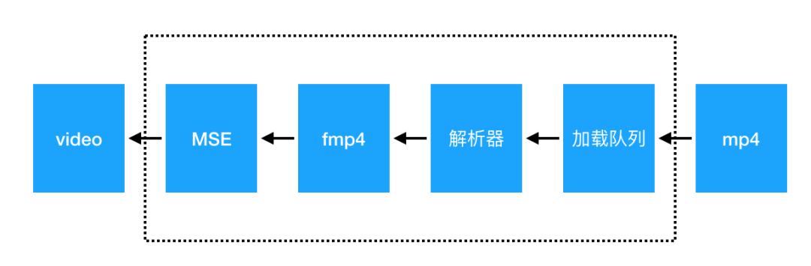
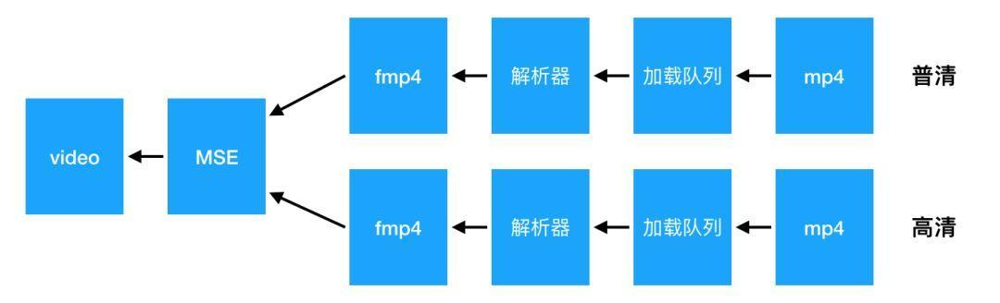
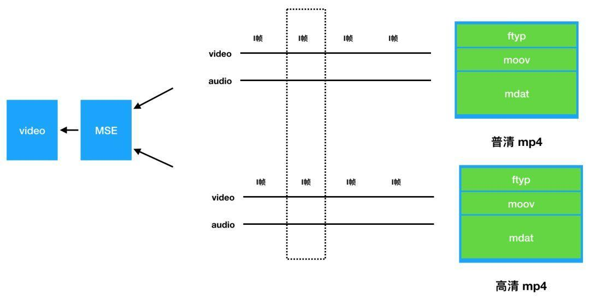
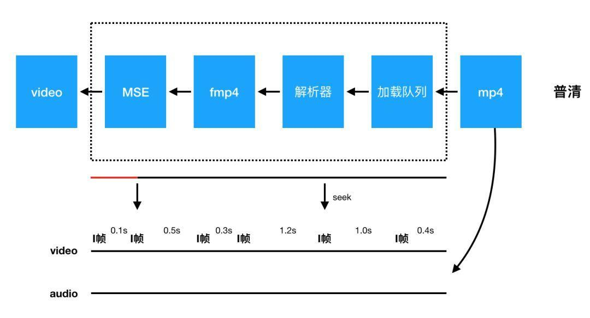

# video标签-mp4

mp4是一种常用的数字多媒体容器格式，HTML5中的video标签原生支持mp4格式的视频播放。这篇文章谈一谈video下如何实现清晰度无缝切换和节省视频流量的功能。

## 1.video原生不支持切换清晰度

> video原生不可以切换清晰度?

是的，mp4是点播领域内最普遍、兼容性最好的视频播放格式，不过它也有局限性，它无法像Youtube那样做到无缝切换。原因在于普通的mp4播放的网络请求类型是media，使用一次http请求所有的视频数据。我们可以通过src属性设置视频地址，触发播放之后浏览器就会开始下载，js干涉不了。而Youtube视频播放采用的是流式的视频容器webm,可以使用js控制分段请求数据。流式视频可以分段请求并独立播放，而非流式的视频格式是不行的。

> 什么是无缝切换清晰度？

**无缝清晰度切换，是指从播放一个分辨率的视频到另一个分辨率的视频，且保证画面、声音不停顿的平滑过程。**

可以使用video无缝切换mp4吗？答案是难度很大。原因如下：

1.video不支持流式的视频格式。

2.video的视频下载过程不受js控制。通过切换src属性必然会导致画面中断、重新请求视频数据等。

有人提出可以利用两个video标签结合z-index来做，但是无法保证两个画面是严格一致的，即使将原来的画面暂停到一个时刻，用另一个视频通过currentTime属性与之同步，切换时仍然可以看到画面闪烁，无法和Youtube无缝切换的体验匹敌，还会造成更多流量的浪费。

还有一种方法是将mp4格式转码成流式视频格式如hls、webm等。不过这种方式只是看起来可行但实际上会带来更大的成本开销，因为视频转码会消耗高昂的机器资源等。

## 2.清晰度切换方案

> video标签支持

由于设置src属性没有操作空间，所以不直接使用src。video不仅支持src属性还支持Blob对象，这个方案就是基于Blob提出来的，播放的流程如下：



1.请求mp4视频数据，结合视频Range服务，做到精确加载；

2.编写解析器将加载回来的部分mp4视频数据进行解复用；

3.将解复用的视频数据转成fmp4格式并传递给MediaSource；

4.使用video进行解码完成播放。

> 方案原理

然后，在切换清晰度的时候流程如下：



1.播放视频A，过程同上；

2.在某个时刻，用户切换到播放视频B，首先解析B的索引文件，反向计算mp4的range区间；

3.加载B的视频区间数据；

4.解复用；

5.把数据转换成fmp4格式并传递给MediaSource；

6.删除A的部分Buffer；

7.在下一个关键帧自动完成画质切换。



这个过程看上去比较繁琐，但是所有的操作都是在浏览器端完成，也就是说都是JS来实现的。这样之前说的所有成本问题都不存在，还能做到Youtube相同体验的无缝切换。西瓜视频提供开箱即用的工具，实现代码大体如下：

```
import Player from 'xgplayer';
import 'xgplayer-mp4';
let player = new Player({
    el: document.querySelector('#mse'),
    url: [
        {
            src: '/mp4/',
            type: 'video/mp4'
        },
        {
            src: '/mp5/',
            type: 'video/mp4'
        }
    ]
});

player.emit('resourceReady', [
    {
        name: '高清',
        url: '/mp4/',
        cname: '高清'
    },
    {
        name: '超清',
        url: '/mp5/',
        cname: '超清'
    }
])
```

如果对这段代码有什么疑惑或者想深入了解下它背后是如何实现的可以参考：https://github.com/bytedance/xgplayer

## 3.节约视频流量

使用video的src属性播放视频时，视频的下载是不受控制的。没有播放的部分其实就浪费掉了，不断seek会造成更多的流量浪费。这部分的流量是可以节省掉的，原理如下：



1.设置每次加载的数据包大小；

2.设置预加载时长；

3.开启加载队列，完成第一次数据包下载，判断缓冲时间和预加载时长是否满足，不满足则请求下一个数据包。

具体实现代码如下：

```
import Player from 'xgplayer';
import 'xgplayer-mp4';
const player = new Player({
    id: 'vs',
    url: '//abc.com/a/mp4',
    preloadTime: 10
});
```

这样就设置了只预加载10s的数据，节省了流量。

了解超能力西瓜播放器是如何炼成的： http://h5player.bytedance.com

## 4.参考文献

[洞察 video 超能力系列——玩转 mp4](https://techblog.toutiao.com/2018/07/09/untitled-51/)


